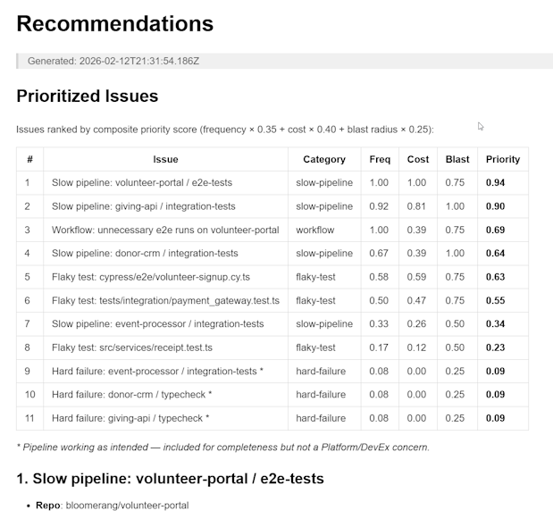

# CI Pipeline Health Analyzer

A CLI tool that analyzes CI run data from GitHub Actions and produces prioritized, data-driven Markdown reports — pipeline health summaries, flaky test detection, time-wasted analysis, and scored improvement recommendations.

## Prerequisites

- [Node.js](https://nodejs.org/) v20+
- npm

## Setup

```bash
npm install
```

## Usage

### Generate reports

```bash
npm run generate
```

Writes three reports to `reports/`:

| Report | Contents |
|--------|----------|
| `pipeline-health.md` | Per-repo success rates, durations (avg/min/max), bottleneck jobs, failure breakdown, CI minutes burned |
| `flaky-tests.md` | Flaky test detection with evidence (runs, branches, actors), retry chains, time wasted |
| `recommendations.md` | Scored priority table (frequency × cost × blast radius), per-issue detail, developer feedback correlation |

### Run tests

```bash
npm test
```

60 tests across 14 describe blocks — analyzers, edge cases, and report structure.

### Run tests with coverage

```bash
npx vitest run --coverage
```

Current coverage: 98% statements, 86% branches, 100% functions, 99% lines.

## Example Output



## Available Scripts

| Script | Command | Description |
|--------|---------|-------------|
| `npm run generate` | `tsx src/index.ts` | Generate reports in `reports/` |
| `npm test` | `vitest run` | Run all tests |

## Project Structure

```
├── .github/workflows/ci.yml       # CI: test → generate → upload reports artifact
├── context/                        # Project brief & reference docs
├── plans/                          # Milestone plans
├── chats/                          # LLM chat history (prompt + response summaries)
├── src/
│   ├── constants.ts                # Shared tunable constants (context-switch penalty)
│   ├── types.ts                    # TypeScript interfaces for data & analysis results
│   ├── index.ts                    # CLI entry point — orchestrates analyzers, renders reports
│   ├── report.test.ts              # 60 Vitest tests
│   ├── data/
│   │   ├── loader.ts               # JSON data loaders
│   │   ├── ci-run-history.json     # 40 CI runs across 6 repos
│   │   ├── workflows.json          # Workflow definitions for 6 repos
│   │   └── developer-feedback.json # 6 developer survey responses
│   └── analyzers/
│       ├── health.ts               # Per-repo health metrics (success rate, duration, bottleneck)
│       ├── failures.ts             # Failure extraction & ephemeral/hard classification
│       ├── flaky.ts                # Flaky test detection (cross-branch/actor patterns)
│       ├── time-wasted.ts          # Retry chain detection & context-switch cost
│       ├── ci-minutes.ts           # CI minutes burned per repo (successful vs wasted)
│       ├── feedback.ts             # Developer feedback ↔ failure data correlation
│       └── prioritize.ts           # Scored prioritization (frequency, cost, blast radius)
├── reports/                        # Generated output (gitignored)
├── package.json
└── tsconfig.json
```
## LLM Usage

This project was built with assistance from GitHub Copilot (Claude). Full chat transcripts with prompts and response summaries are in the `chats/` folder. Key decisions — tech stack, architecture, scoring model — were made through interactive Q&A documented there.
